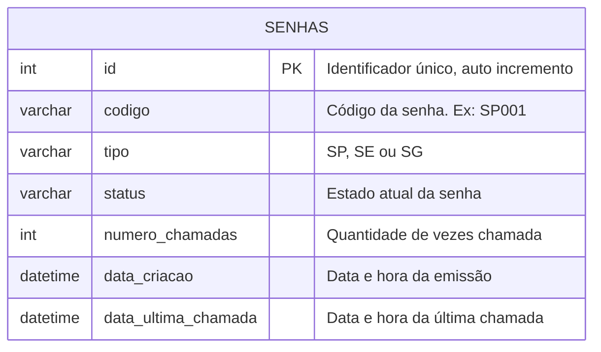

# Modelo Entidade-Relacionamento (MER) — Nassau Tickets

## 1. Visão geral

Para o MVP do sistema, a modelagem de dados foi centralizada em uma única entidade, `SENHAS`, que concentra as informações necessárias para controlar todo o ciclo de vida de uma senha: emissão, fila, chamadas e atendimento.

Essa decisão foi tomada porque, nesta fase do projeto, não há ainda persistência de atendentes, guichês ou usuários com login — o foco é o fluxo de emissão → fila → atendimento, conforme o escopo definido no `docs/requirements/`.

## 2. Diagrama

## 3. Dicionário de dados

| Atributo | Tipo | Restrições | Descrição |
|---|---|---|---|
| `id` | INT | PK, AUTO_INCREMENT | Identificador único do registro. |
| `codigo` | VARCHAR | NOT NULL | Código visível da senha, no formato `TT###` (ex: `SP001`, `SE014`, `SG002`). |
| `tipo` | VARCHAR | NOT NULL | Um dos três valores: `SP` (Prioritária), `SE` (Retirada de Exames) ou `SG` (Geral). |
| `status` | VARCHAR | NOT NULL | Estado atual da senha na máquina de estados (ver `docs/models/uml/`). |
| `numero_chamadas` | INT | DEFAULT 0 | Quantas vezes a senha já foi chamada — usado para decidir quando marcar como `NÃO COMPARECEU`. |
| `data_criacao` | DATETIME | DEFAULT NOW() | Momento da emissão da senha. Usado para calcular a numeração diária e ordenar a fila (FIFO por tipo). |
| `data_ultima_chamada` | DATETIME | NULL | Momento da última chamada. Usado para saber qual senha está em atendimento no momento. |

## 4. Regras de negócio refletidas no modelo

- A numeração (`codigo`) é **reiniciada diariamente por tipo** — por isso o backend consulta `MAX(...)` filtrando por `tipo` e `DATE(data_criacao) = CURDATE()` antes de gerar uma nova senha (RN09 do documento de requisitos).
- Não existe uma tabela separada de "fila": a fila é uma **consulta** (`SELECT ... WHERE status = 'AGUARDANDO'`), não uma estrutura de dados própria.
- O "atendimento atual" também é derivado por consulta, buscando a senha com status em `CHAMADA`, `CHAMADA NOVAMENTE` ou `EM ATENDIMENTO`.

## 5. Evolução prevista

Conforme a seção "Funcionalidades previstas para evolução" do documento de requisitos, o modelo deve crescer para contemplar novas entidades quando essas funcionalidades forem implementadas:

| Entidade futura | Motivo |
|---|---|
| `ATENDENTES` | Necessária para o sistema de login e para registrar qual atendente realizou cada chamada. |
| `GUICHES` | Necessária caso o sistema passe a identificar formalmente qual guichê atendeu cada senha. |
| `AUDITORIA` | Necessária para o relatório de auditoria (primeira chamada, segunda chamada, início e fim do atendimento). |

Essas entidades **não fazem parte do MVP atual** e serão adicionadas a este diagrama quando entrarem em desenvolvimento.
