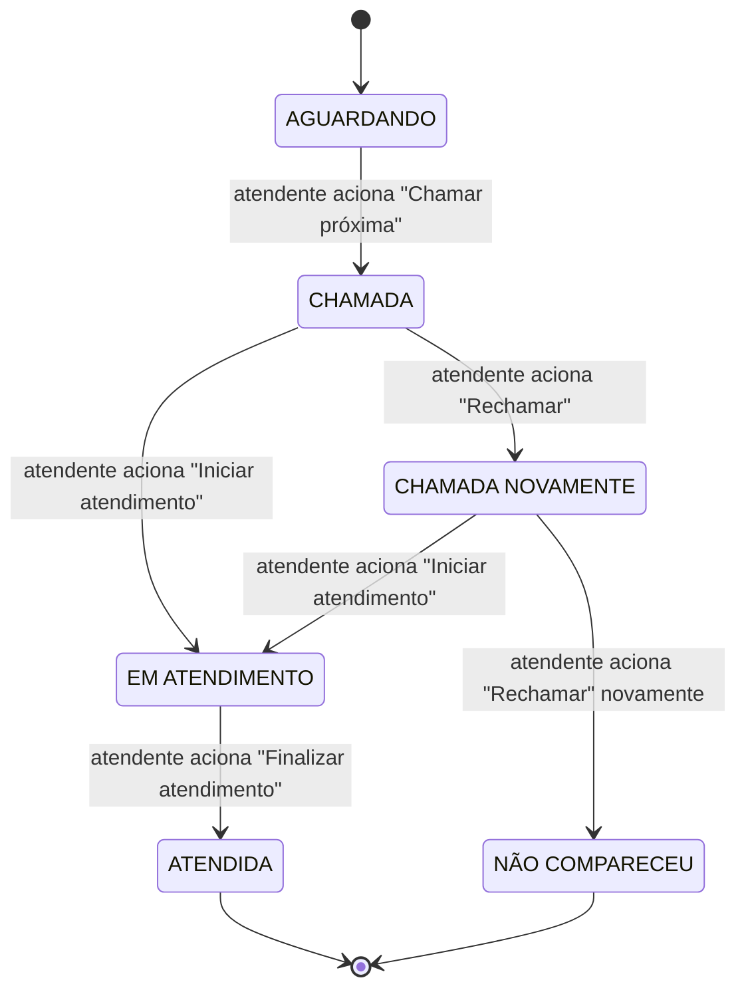
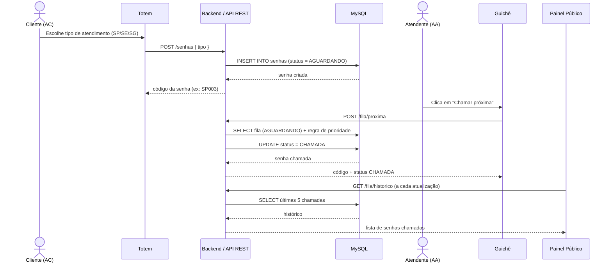
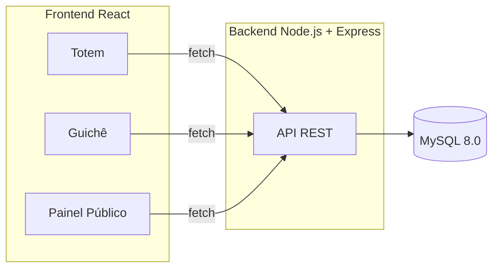

# Diagramas UML — Nassau Tickets

## 1. Diagrama de Estados da Senha

Reflete exatamente a máquina de estados implementada nas rotas `/fila/proxima`, `/fila/rechamar`, `/fila/iniciar` e `/fila/finalizar` do backend.

**Regras aplicadas em cada transição** (RN04, RN05 e RN06 do documento de requisitos):

- Uma senha só pode ser rechamada se estiver em `CHAMADA` ou `CHAMADA NOVAMENTE`.
- Uma senha só pode iniciar atendimento se estiver em `CHAMADA` ou `CHAMADA NOVAMENTE`.
- Uma senha só pode ser finalizada se estiver em `EM ATENDIMENTO`.
- Após a segunda chamada sem resposta, a senha vai direto para `NÃO COMPARECEU` e sai do fluxo.

## 2. Diagrama de Sequência — Emissão e Chamada de Senha

Mostra a interação entre os três agentes do sistema (AC, AA, AS) e os componentes técnicos.

## 3. Diagrama de Componentes — Arquitetura do Sistema

Cada uma das três telas do frontend se comunica com o backend de forma independente, via `fetch`, consumindo os mesmos endpoints REST descritos no README principal do projeto.

## 4. Legenda dos agentes (conforme especificação do sistema)

| Sigla | Agente | Papel |
|---|---|---|
| AS | Agente Sistema | O backend (Node.js + Express) e o banco de dados (MySQL) — processa regras, persiste dados e responde às requisições. |
| AA | Agente Atendente | Pessoa que opera a tela do Guichê: chama, rechama, inicia e finaliza atendimentos. |
| AC | Agente Cliente | Pessoa que interage com o Totem para emitir sua senha e acompanha o Painel Público. |
